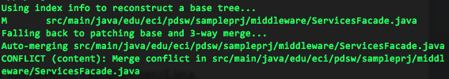

### Escuela Colombiana de Ingeniería
### Procesos de desarrollo de software – PDSW

Administración de la configuración – Control de versiones con GIT
# Trabajo en parejas

1. Descargue y descomprima el proyecto suministrado (ProyectoBase.zip).
2. Cree una cuenta (para cada integrante del grupo) en GitHUB. En una de las dos cuentas, cree un nuevo repositorio. Invite al usuario de su compañero como colaborador de dicho proyecto.
3. En el directorio raíz del proyecto, crear un archivo .gitignore (con un punto a la izquierda del nombre), en el cual se especifique que el directorio ‘target’ no hará parte del control de versiones (agregue a dicho archivo una línea con: target ).
4. Cree un repositorio local para dicho proyecto, con:
git init .
5. Agregue todos los elementos actuales dentro del repositorio con:
git add .
6. Haga commit de los cambios en el repositorio local, incluyendo un mensaje descriptivo, por ejemplo:
git commit -m "primera revisión del proyecto"
7. Haga push de la rama ‘master’ repositorio local al repositorio creado anteriormente en la organización de GitHub:
git push URL_REPOSITORIO master
8. Rectifique, en la respectiva página Web, que los archivos hayan quedado en el repositorio de GitHub.

9. Entre los integrantes, distribúyanse los roles de autor 1 y autor 2, y realicen las siguientes tareas en computadores diferentes:

	__Autor 1 y 2:__
	
	Clonar el proyecto localmente:
	
	```bash
		git clone
	```
	
	__Autor 1:__
	
	* Modifica el pom.xml, para que incluya el servidor embebido de Tomcat (agregar en los 'plugins' de la fase 'build'):

		```xml
            <!-- Tomcat embedded plugin. -->
            <plugin>
                <groupId>org.apache.tomcat.maven</groupId>
                <artifactId>tomcat7-maven-plugin</artifactId>
                <version>2.2</version>
                <configuration>
                    <port>8080</port>
                    <path>/</path>
                </configuration>
            </plugin>
		```

	* Commit
	* Push a GitHub
	
	
	
	__Autor 2:__
	
	* Agregar al descriptor de la aplicación Web (web.xml) la configuración que permite habilitar el servlet de PrimeFaces:
	
		```xml
	    <servlet>
	        <servlet-name>Faces Servlet</servlet-name>
	        <servlet-class>javax.faces.webapp.FacesServlet</servlet-class>
	        <load-on-startup>1</load-on-startup>
	    </servlet>
	    <servlet-mapping>
	        <servlet-name>Faces Servlet</servlet-name>
	        <url-pattern>/faces/*</url-pattern>
	    </servlet-mapping>
	    <session-config>
	        <session-timeout>
	            30
	        </session-timeout>
	    </session-config>
	    <welcome-file-list>
	        <welcome-file>faces/index.xhtml</welcome-file>
	    </welcome-file-list>	
		```
	
	Si para alguno no es posible (por consistencia) hacer el ‘push’, haga un pull a la rama ‘master’ del repositorio en GitHub con ‘rebase’:

	
	```
		git pull --rebase URL_REPOSITORIO master
	```
	
	Al final, todos rectificar que quedan con la última versión respecto al repositorio de GitHUB:
	
	```
		git pull URL_REPOSITORIO master
	```

10. De nuevo, en dos computadores diferentes:

	__Autor 1:__
	* En la clase de pruebas ClientesTest defina -en comentarios- las clases de equivalencia para las pruebas del método de registro de nuevos clientes.
	Tenga en cuenta la especificación del método registrarCliente (agréguela al código):	
 
	```
	    /**
	     * @obj registrar un cliente en el sistema
	     * @param p el nuevo cliente
	     * @pre p!=null
	     * @pos el cliente queda disponible para futuros alquileres
	     * @throws ExcepcionServiciosAlquiler si el cliente ya se encuentra registrado
	     */
	    public abstract void registrarCliente(Cliente p) throws ExcepcionServiciosAlquiler;
	```
	
	* Implementar una prueba de una de dichas clases de equivalencia.
	* Commit
	* Push a GitHub
	
	
	__Autor 2:__

	* En la clase de pruebas AlquilerTest agregue -en comentarios- más clases de equivalencia/casos de frontera para las pruebas del método de registro nuevo alquiler.
	* Implementar una prueba adicional (ya hay dos implementadas) de una de dichas clases de equivalencia.
	* Commit
	* Push a GitHub


11. Ahora, los dos autores van a trabajar simultáneamente sobre el mismo método de un archivo:

	__Autor 1:__
	* En la interfaz de Servicios, Corrige la ortografía de la documentación del método 'registrarAlquilerCliente'
	* Commit
	* Push
	
	__Autor 2:__

	* En la interfaz de Servicios, corrige la documentación de la sección '@Throws' de la documentación del método 'registrarAlquilerCliente', ya que hace referencia a una excepción diferente a la que el método define que podría ser lanzada.
	* Commit
	* Push


	Si para alguno no es posible (por consistencia) hacer el ‘push’, haga un pull a la rama ‘master’ del repositorio en GitHub con ‘rebase’, como en el paso anterior.
En este caso, probablemente no sea posible hacer una ‘mezcla’ automática de los cambios hechos desde dos repositorios diferentes, lo cual se muestra en un mensaje como este:

	


	De manera que la acción de --rebase queda inconclusa hasta que se corrijan los conflictos generados. Para este caso, edite el archivo, y ajuste el conflicto, el cual se presenta con el siguiente formato:

	```
		<<<<<<< HEAD (commit más reciente del repositorio)
			Cambio obtenido del respositorio externo 
			Mediante el pull --rebase
		=======
			Cambio del repositorio local que se intentó 
			combinar con el cambio del repositorio externo.
		>>>>>>> comentario del último commit
	```

	Una vez generada una versión válida, agregue el cambio con:

	```
		git add NombreDelArchivo.java
		git rebase --continue
	```

	Y posteriormente, haga push a la nuevos cambios al repositorio de GitHUB con push. Al final, todos deben hacer un ‘pull’ para garantizar que estén trabajando sobre la última versión.

12. (Para el Jueves) Implementar la aplicación Web que permita agregar nuevos clientes a la videotienda, y registrar alquileres para los mismos. Ambas funcionaliadades estarán en dos vistas difernetes (registroentradasforo.xhtml, registrorespuestaforo.xhtml), de acuerdo con las siguientes especificaciones (tenga en cuenta que, por ahora, la aplicación no maneja ningún esquema de autenticación):
	
	1. Se debe completar la implementación de las pruebas de SÓLO aquellas pruebas asociadas al alcance del ejercicio y hacer los ajustes necesarios en caso de encontrar defectos en la implementación de 'ServiciosAlquilerItemsStub'. Específicamente lo requerido es:
		* Registro cliente.
		* Registro alquiler.
		* Cálculo de multa de devolución.
	2. La vista de 'registro de clientes' debe (1) mostrar el listado de los clientes registrados hasta el momento (con la opción de selecciar de uno de éstos), y (2) debe mostrar los campos para poder registrar un nuevo cliente (con su respectivo botón de registro). Cuando se registre un nuevo cliente, se debería automáticamente mostrar el nuevo cliente en la parte superior. 
	3. Cuando se seleccione uno de los usuarios ya creados, se debe redirigir al usuario a la vista de 'registro de alquileres'. En esta vista, dado el cliente seleccionado, se debe (1) mostrar los items que no ha regresado, junto con el valor de la multa total asociada a los mismos a la fecha (fecha del sistema), y (2), debe permtir registrar un nuevo alquiler ingresando el código del ítem (asumiendo que éste se ingresará con un lector de código de barras), el número de días del alquiler, y mostrando el costo del alquiler antes de su confirmación.
	4. Ambas vistas se basarán en el ManagedBean de sesión 'AlquilerItemsBean', el cual -a su vez- hace uso de los 'ServiciosAlquilerItems'.
	5. El desarrollo de ambas vistas debe quedar distribuido entre los dos desarrolladores de la siguiente manera:
	
		* Desarrollador 1: Vista registro de cliente.
		* Desarrollador 2: Vista registro de alquiler.
		* Desarrollador 1 y 2: ManagedBean 'RegistroAlqulerBean'.

	Nota. Para ver cómo navegar entre vistas con JSF revise [este enlace.](http://www.tutorialspoint.com/jsf/jsf_page_navigation.htm)
	
13. Entrega:
	1. En los 'logs' de GitHUB debe quedar evidencia de los 'commit' realizados por cada autor, y en computadores diferentes (esto es verificable). Para esto, no olvide configurar su usuario antes de hacer los commits:

		```
			$ git config --global user.name "John Doe"
			$ git config --global user.email johndoe@example.com
		```
	2. Subir en el espacio de moodle un archivo de texto que tenga los integrantes, qué rol se asignó a cada uno (desarrollador 1/ desarrollador 2) y la URL del repositorio en GitHUB.


### Referencias adicionales:

[No Changes - Did You Forget to Use ‘Git Add’?](http://wholemeal.co.nz/blog/2010/06/11/no-changes-did-you-forget-to-use-git-add/)

[Git – rebasing – step by step](http://gitforteams.com/resources/rebasing.html)

[Guía rápida GIT](http://rogerdudler.github.io/git-guide/)
